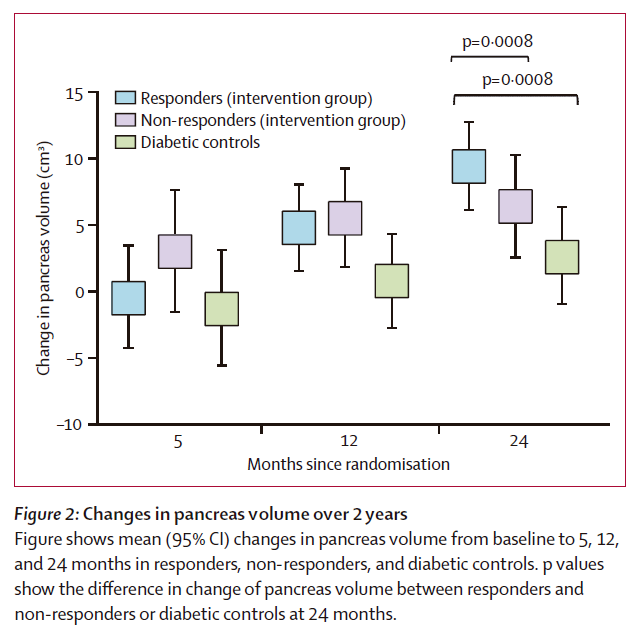
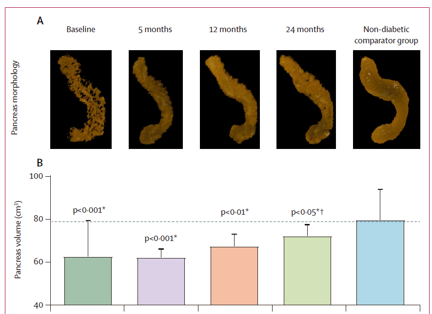
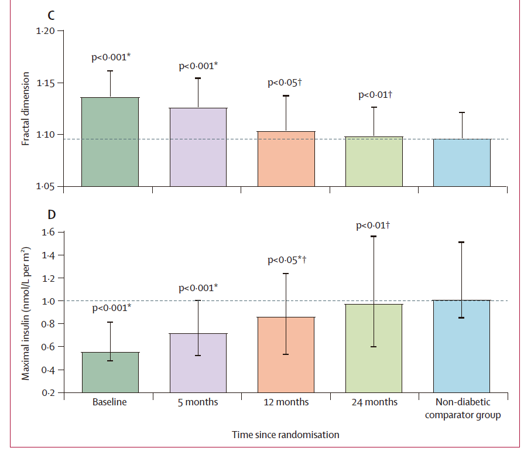

```{r setup, include=FALSE}
knitr::opts_chunk$set(echo = FALSE)
```

# Introducción

## Morfología del pancreas

- Volumen disminuido en diabetes mellitus tipo 2 (DM2) (20-30%)
- Bordes irregulares

## ¿Alteraciones morfológicas como predisponentes o secundarios a la DM2?

- Secundario
- Deficiencia de la función endocrina:
  - Insulina como factor de crecimiento
  - Otros factores de crecimiento
  - Grasa intrapancreática como fibrosante
  
## Antecedentes

- Estudio previo no encontró aumento de volumen en pacientes cuya glucosa se mantuvo como no diabética por **6 meses**.
- Hipótesis: El efecto sería a mayor plazo
- El ensayo clínico DiRECT ha logrado un buen control de glucosa en el 36% de su grupo intervención en **2 años**.

## Objetivos

- Determinar si ocurren cambios en el volumen y forma del páncreas durante 2 años de remisión de DM2

# Metodología

## Diseño de estudio

Análisis post-hoc de la base de datos DiRECT

## Criterios de inclusión

-  20 y 65 años de edad
- diagnosticados de diabetes tipo 2 en los 6 años anteriores
- IMC de 27 a 45 kg/m²

## Criterios de exclusión 

- uso actual de insulina
- HbA1c superior al 12% (108 mmol/mol) o superior
- pérdida de peso de más de 5 kg en los 6 meses anteriores
- tasa de filtración glomerular estimada registrada recientemente inferior a 30 mL/min por 1-73 m².

## Grupo 1: Voluntarios no diabéticos sanos

- Se agregó al estudio un grupo de no diabéticos como control de 25 participantes
- Emparejamiento por edad, sexo, peso después de la pérdida de peso

## Grupo 2: Diabéticos con intervención

- el programa de control de peso Counterweight-Plus (dieta de fórmula líquida [825-853 kcal/día] durante 3-5 meses),
- seguido de la reintroducción gradual de alimentos
- y una fase de mantenimiento del peso de baja intensidad hasta los 24 meses.

## Grupo 3: Diabéticos sin intervención:
- continuaron con su tratamiento rutinario de la diabetes basado en las guías clínicas actuales

## Evaluaciones
- 0, 5, 12 y 24 meses
- Luego de ayuno toda la noche
- Incluye:
  - Secreción de insulina
  - Resonancia magnética (volumen, forma, grasa intrapancreática, Grasa subcutánea y visceral)
  - HbA~1c~
  - Proteína C Reactiva
  - TG totales
  - Glucosa
  - IGF-1, GDF-15, and FGF-21
  - Resistencia a la insulina (HOMA2 calculator)
- Respuesta = HbA1c <6-5% [48 mmol/mol] y glucemia en ayunas <7 mmol/L, sin medicación antidiabética desde el inicio 

## Desenlaces de interés

- Volumen pancreático
- Irregularidades del borde pancreático (dimensión fractal)

## Comparaciones

- Respondieron a la intervención de pérdida de peso vs No respondieron
- Diabéticos con intervención vs No diabéticos sanos (ver grado de normalización)
- Diabeticos sin intervención vs No diabéticos sanos 

## Análisis estadístico {.allowframebreaks}

- modelo de regresión de efectos mixtos (ANOVA, Bonferroni) para evaluar el cambio en desenlaces de interés 
- ajustar la edad, el sexo, la duración de la diabetes, el peso corporal inicial y el volumen del páncreas inicial o la dimensión fractal. 
- Para los valores absolutos, media (SD) o mediana (IQR) según la distribución de los datos. 
- Para los cambios con respecto al inicio, los datos se presentan como media (IC del 95%). 
- Para los datos pareados, prueba t pareada de Student o la prueba de rangos con signo de Wilcoxon según la distribución de los datos. 
- Para los análisis no pareados, se utilizó la prueba U de Mann-Whitney o la prueba t de dos muestras. 
- Para la correlación, se utilizó el rango de Pearson o el de Spearman, según el caso. 
- Minitab (versión 17) y SPSS (versión 26). 
- p<0-05 era estadísticamente significativo. 

# Resultados

## Perfil del estudio


## Cambio de volumen en todos los grupos



## Cambios en forma y volumen en grupo intervención



## Bordes (fractal) y secreción de insulina


# Discusión

## Discusión

- Primer estudio
- Hasta 90% de volumen de un sano
- Completo retorno a la regularidad de borde pancreático
- Asociado a disminución de grasa intrapancreática
- Retorno a la normalidad de secreción de insulina de primera fase

## Conclusiones

> Sugerimos que el páncreas pequeño e irregular, típico de la diabetes de tipo 2, es secundario al propio estado de la enfermedad y vuelve a la normalidad durante 2 años de remisión inducida por la pérdida de peso con la dieta. [@al-mrabeh20202year]

## Referencias {.allowframebreaks}

<div id="refs"></div>

